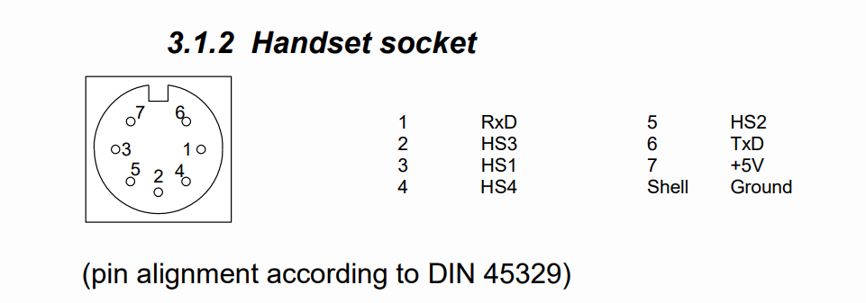

# logicdata-standing-desk

This repository is about reverse engineering a standing desk from Kinnarps.
It applies to all hight adjustable tables with the [`LOGICDATA COMPACT-e-2L-O-V-EU Revision 2/1.9.14`](/hardware/main_unit.png) main units with the controller [`LOGICDATA HSF MDF 4M4 Rev3`](/hardware/controller_2.png) (click the link for pictures).

The controller and main unit are connected via a `MAS 70S DIN 45329` connector.
It has the following layout: (also later found in [documentation](https://web.archive.org/web/20230817093331/https://www.logicdata.net/wp-content/uploads/2017/05/Datasheet_Compact_English-Rev4.pdf))



| Line  | Name | Description                                  | Captured Channel |
| ----- | ---- | -------------------------------------------- | ---------------- |
| SHELL | GND  | Ground                                       |                  |
| 6     | Tx   | Serial communication to the display (height) | 0                |
| 1     | Rx   | Serial communication to the controller       | 1                |
| 4     | HS4  | See next table.                              | 2                |
| 2     | HS3  | See next table.                              | 3                |
| 5     | HS2  | See next table.                              | 4                |
| 3     | HS1  | See next table.                              | 5                |
| 7     | Vcc  | Voltage supply                               | 6                |

By hooking up a logic analyzer the following functions could be recorded (see the [records](/records/) folder for raw files from [Salea Logic Analyzer](https://www.saleae.com/downloads/)).

| Button Action | HS1 (line 3) | HS2 (line 5) | HS3 (line 2) | HS4 (line 4) |
| ------------- | ------------ | ------------ | ------------ | ------------ |
| Down          | HIGH         | LOW          | LOW          | HIGH         |
| Up            | HIGH         | LOW          | HIGH         | LOW          |
| position 1    | LOW          | LOW          | HIGH         | LOW          |
| position 2    | LOW          | LOW          | LOW          | HIGH         |
| position 3    | LOW          | HIGH         | LOW          | HIGH         |
| position 4    | LOW          | HIGH         | HIGH         | LOW          |
| position save | HIGH         | HIGH         | LOW          | LOW          |

# Serial communication

Through extensive googling this [communication datasheet](http://web.archive.org/web/20230814225435/http://logicoffice.at/download/datasheets/communication_en.pdf) turned up but when used to decode the signal it turned up garbage.
So I turned to other projects already working but not with ESPHome ([phord/RoboDesk](https://github.com/phord/RoboDesk) and [davidknezic/desk](https://github.com/davidknezic/desk)).

They used `1ms` data rate so I came up with these settings:

```
Bit/Baud Rate: 1000 Bit/s
Bits per Frame: 8
Stop Bits: 1
Parity Bit: even
Significant Bit: Most Significant Bit First
Signal Inversion: Yes
```

Capturing the converted output in [standing-desk_logs.hex](/records/standing-desk_logs.hex).

To extract the data this [thread](https://web.archive.org/web/20170720061035/https://www.mikrocontroller.net/topic/369941#new) turned out to be useful, stating that the last 8 bits of a message are the height.
With a [`serial_data.py`](/serial_data.py) script I could confirm the numbers.

# Connecting UpsyDesky (esphome-standing-desk)

https://github.com/tjhorner/esphome-standing-desk

I don't have an adapter but I still [reuse the PIN Layout](https://upsy-desky.tjhorner.dev/docs/reference/gpio/) of the D1_mini.

<!-- | RJ45 Pin | GPIO Pin (ESP32)  -->
<!-- | -------- | ----------------  -->
<!-- | 1        | 18                -->
<!-- | 2        | 17                -->
<!-- | 3        | N/A (GND)         -->
<!-- | 4        | 16                -->
<!-- | 5        | N/A (+5V)         -->
<!-- | 6        | 19                -->
<!-- | 7        | 21                -->
<!-- | 8        | 22                -->

| GPIO Pin (D1_mini - [Layout](https://randomnerdtutorials.com/esp8266-pinout-reference-gpios/)) | DIN 45329 | ESPHome Name              | Logicdata Name |
| ---------------------------------------------------------------------------------------------- | --------- | ------------------------- | -------------- |
| N/A (GND)                                                                                      | SHELL     |                           |                |
|                                                                                                | 1         |                           |                |
| D7                                                                                             | 2         | bit3                      | HS3            |
| D5                                                                                             | 3         | bit1                      | HS1            |
| D8                                                                                             | 4         | bit4                      | HS4            |
| D6                                                                                             | 5         | bit2                      | HS2            |
| D2                                                                                             | 6         | standing_desk_uart_rx_pin | Tx             |
| N/A (+5V)                                                                                      | 7         |                           |                |

The actions in `example_sensor.yaml` are working.

# Discussion about Logicdata Desks

https://web.archive.org/web/20230812201115/https://www.mikrocontroller.net/topic/373579
